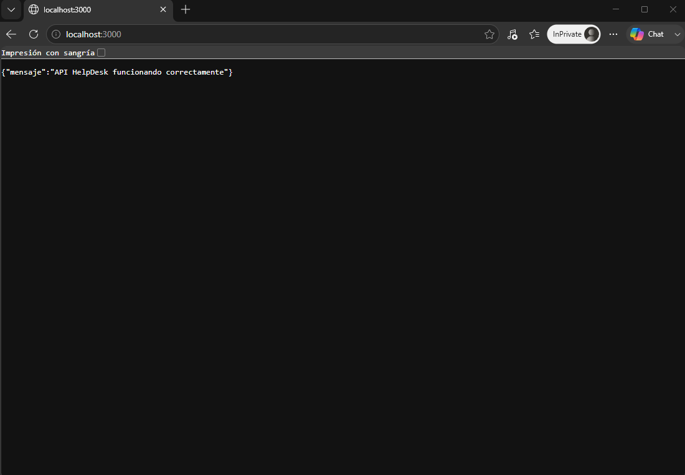
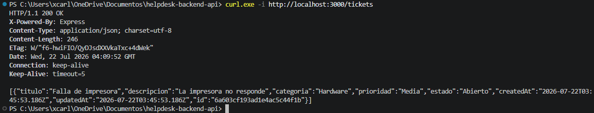

# Helpdesk Backend API

Este proyecto corresponde al desarrollo del backend para un sistema de gestión de incidentes o Help Desk. La API permite registrar, consultar, actualizar y eliminar tickets mediante endpoints RESTful, utilizando Node.js, Express y MongoDB Atlas.

## Tecnologías utilizadas

- Node.js
- Express
- MongoDB Atlas
- Mongoose
- Dotenv
- PowerShell
- cURL
- GitHub

## Estructura del proyecto

```text
helpdesk-backend-api/
│
├── models/
│   └── Ticket.js
│
├── routes/
│   └── ticketRoutes.js
│
├── .gitignore
├── index.js
├── package.json
├── package-lock.json
└── README.md
```

## Instalación y uso

Para ejecutar el proyecto de forma local, primero se debe clonar el repositorio o descargar el código fuente.

Luego, dentro de la carpeta del proyecto, se instalan las dependencias con el siguiente comando:

```bash
npm install
```

Después se debe crear un archivo `.env` en la raíz del proyecto con la configuración necesaria para la conexión a MongoDB Atlas.

Ejemplo:

```env
PORT=3000
MONGODB_URI=tu_cadena_de_conexion
```

Por seguridad, el archivo `.env` no se incluye en el repositorio, ya que contiene información sensible.

Para iniciar el servidor se puede utilizar:

```bash
node index.js
```

Si el proyecto tiene configurado el script de inicio en `package.json`, también se puede ejecutar:

```bash
npm start
```

Cuando la conexión se realiza correctamente, el servidor queda disponible en:

```text
http://localhost:3000
```

## Modelo de datos

Cada ticket contiene los siguientes campos principales:

- `titulo`
- `descripcion`
- `categoria`
- `prioridad`
- `estado`

Las categorías permitidas son:

- Red
- Hardware
- Software

Las prioridades disponibles son:

- Alta
- Media
- Baja

Los estados disponibles son:

- Abierto
- En Progreso
- Cerrado

## Endpoints principales

La API cuenta con las operaciones CRUD necesarias para la gestión de tickets:

| Método | Endpoint | Descripción |
|---|---|---|
| GET | `/tickets` | Obtiene la lista de tickets registrados. |
| GET | `/tickets/:id` | Consulta un ticket específico mediante su identificador. |
| POST | `/tickets` | Crea un nuevo ticket. |
| PUT | `/tickets/:id` | Actualiza los datos o el estado de un ticket existente. |
| DELETE | `/tickets/:id` | Elimina un ticket mediante su identificador. |

## Ejemplo de ticket

```json
{
  "titulo": "Problema con internet",
  "descripcion": "El usuario reporta que no tiene conexión a la red",
  "categoria": "Red",
  "prioridad": "Alta",
  "estado": "Abierto"
}
```

## Pruebas

Las rutas de la API fueron probadas desde PowerShell mediante `Invoke-RestMethod` y también con cURL.

Se verificaron las solicitudes GET, POST, PUT y DELETE, comprobando que el servidor devolviera respuestas en formato JSON y códigos de estado HTTP correctos, como `200 OK` y `201 Created`.

Ejemplo de prueba con cURL:

```bash
curl -i http://localhost:3000/tickets
```

## Evidencias

### API funcionando localmente



### Prueba de los endpoints



## Control de versiones

El desarrollo se realizó en la rama:

```text
feature/backend-api
```

Posteriormente, los cambios fueron fusionados con la rama:

```text
develop
```

## Nota de seguridad

El archivo `.env` y la carpeta `node_modules/` no se incluyen en el repositorio.

El archivo `.gitignore` contiene:

```gitignore
node_modules/
.env
```
